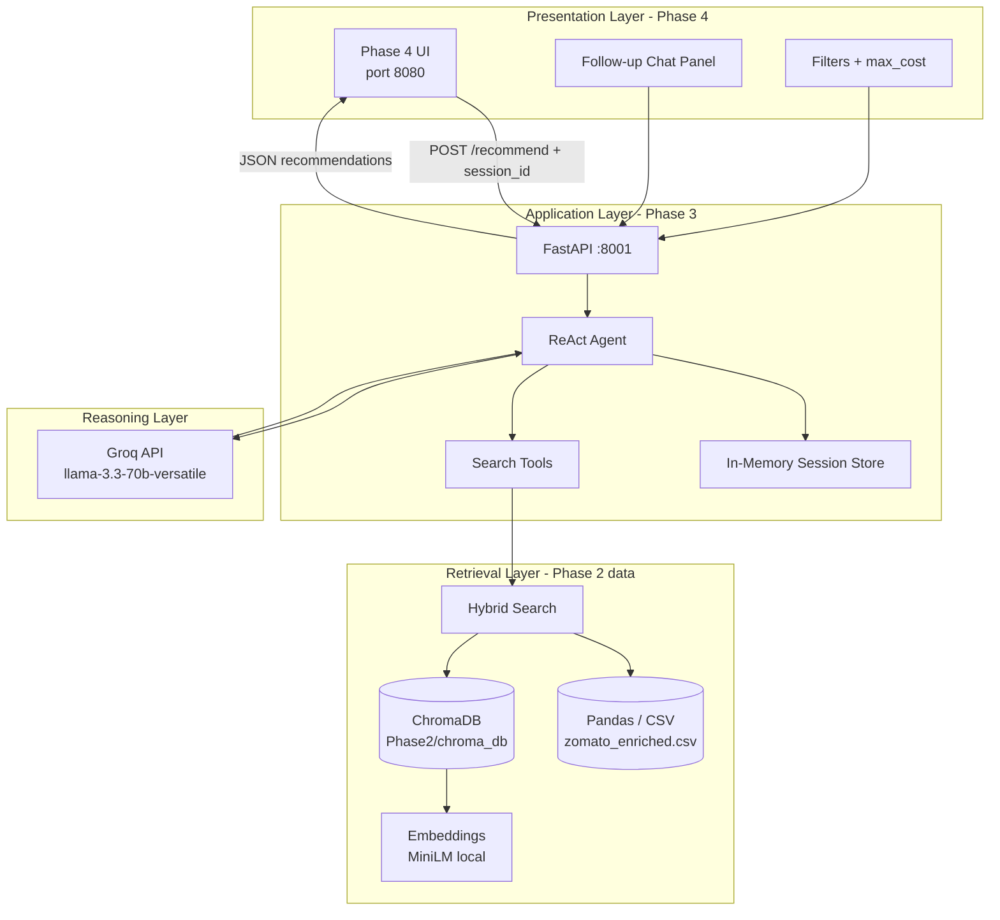
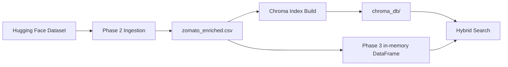
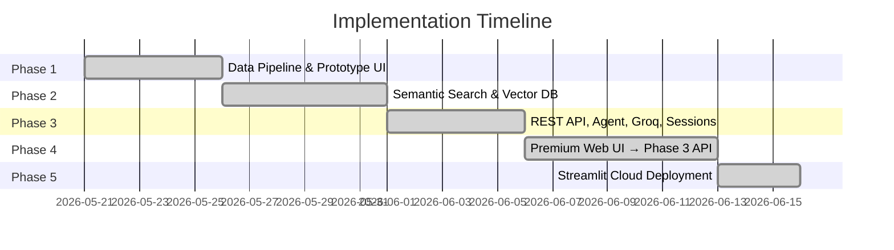
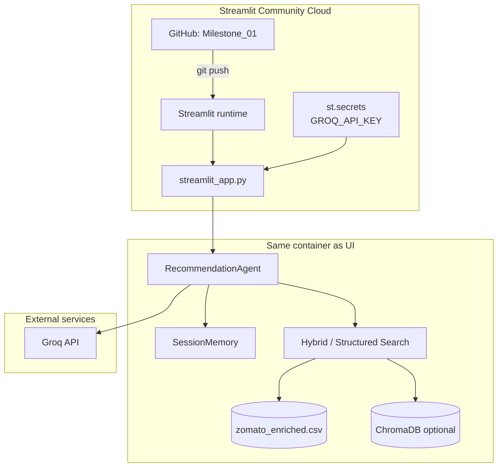

# Phase-Wise Architecture: AI-Powered Restaurant Recommendation System

This document describes the **current** system layout after Phases 1–4 and **Phase 5** (Streamlit Cloud deployment). The production backend lives in **Phase 3**; the user-facing UI is available via **Phase 4** (premium static app) or **Phase 5** (hosted Streamlit app).

---

## Repository layout

```
Milestone_01/
├── Docs/                    # architecture, problem statement, edge cases
├── Phase1/                  # Data ingestion, pandas filters, prototype UI (Gemini)
│   ├── data/zomato_cleaned.csv
│   └── src/
│       ├── ingestion.py
│       ├── filter.py
│       ├── llm_client.py
│       ├── main.py          # FastAPI + embedded HTML (port 8000)
│       └── templates/index.html
├── Phase2/                  # Hybrid retrieval + ChromaDB index
│   ├── data/zomato_enriched.csv
│   ├── chroma_db/
│   └── src/
│       ├── ingestion.py     # review snippets + search_text
│       ├── embeddings.py    # sentence-transformers (all-MiniLM-L6-v2)
│       ├── vector_store.py
│       ├── hybrid.py
│       └── main.py          # CLI: build-index, hybrid search
├── Phase3/                  # Production API + agent + Groq (port 8001)
│   ├── .env.example
│   └── src/
│       ├── main.py          # FastAPI: /health, /recommend, /session
│       ├── agent.py         # ReAct orchestrator
│       ├── session_memory.py
│       ├── tools.py
│       ├── groq_client.py
│       ├── llm_client.py
│       ├── hybrid.py, filter.py, vector_store.py
│       └── ...
└── Phase4/                  # Premium UI (port 8080) → Phase 3 API
    ├── server.py
    └── public/
        ├── index.html
        ├── css/styles.css
        └── js/app.js, config.js
├── Phase5/                  # Streamlit Cloud UI (port 8501) — in-process Phase 3
│   ├── streamlit_app.py
│   ├── requirements.txt
│   └── p5/
│       ├── config.py        # env + Streamlit secrets
│       ├── stack.py         # @st.cache_resource agent loader
│       └── ui.py            # Zomato light theme components
├── streamlit_app.py         # Root entrypoint for Streamlit Cloud → Phase5
├── requirements.txt         # Root deps for Streamlit Cloud / Vercel
├── .streamlit/
│   ├── config.toml          # Streamlit theme (Zomato red / light)
│   └── secrets.toml.example # Streamlit Cloud secrets template
└── Screens/                 # Static UI mockups (design reference)
    └── zomato-ai-home/
```

| Layer | Canonical location | Notes |
|--------|-------------------|--------|
| **Backend API** | `Phase3/` | All clients call this service |
| **Frontend UI** | `Phase4/` | Static SPA; `POST` → Phase 3 only |
| **Hosted UI (Streamlit)** | `Phase5/` | Phase 5; in-process Phase 3 agent; root `streamlit_app.py` for Cloud |
| **Vector index & enriched CSV** | `Phase2/` | Phase 3 reads these paths; build index in Phase 2 |
| **Baseline data pipeline** | `Phase1/` | Legacy demo; superseded for production |
| **Legacy prototype** | `Phase1/src/templates/index.html` | Phase 1 API + Gemini on port 8000 |
| **UI mockups** | `Screens/` | Static screens; not wired to API |

---

## Current system architecture (after Phase 3)



**Request flow (production path — Phase 3 + Phase 4):**

1. Client sends filters + natural language to `POST /recommend` on Phase 3.
2. Agent merges request with **session memory** (multi-turn follow-ups).
3. Agent selects a tool: `structured_search`, `hybrid_search`, `refine_previous`, or `relax_filters`.
4. Hybrid path applies hard filters on pandas, then semantic ranking via Chroma (when index is available).
5. Top 15 candidates go to **Groq** for final top-5 ranking and explanations.
6. Response returns `session_id`, `recommendations[]`, `tools_used`, and `filters_applied`.

---

---

## Backend (Phase 3) — API contract

**Base URL:** `http://127.0.0.1:8001` (configurable via `API_HOST`, `API_PORT`)

| Method | Path | Purpose |
|--------|------|---------|
| `GET` | `/health` | Liveness, dataset size, Chroma document count, active sessions |
| `POST` | `/recommend` | Run agent; return top recommendations |
| `DELETE` | `/session/{session_id}` | Clear conversation state |

**`POST /recommend` body (example):**

```json
{
  "session_id": null,
  "location": "Bellandur",
  "cuisine": "",
  "budget_tier": "",
  "min_rating": 4.0,
  "max_cost": 2000,
  "description": "quiet place with good ambience"
}
```

**Response (example shape):**

```json
{
  "session_id": "uuid",
  "recommendations": [
    {
      "name": "Restaurant Name",
      "rating": 4.4,
      "cost": 1400,
      "cuisines": "North Indian, Chinese",
      "location": "Bellandur",
      "explanation": "Groq-generated rationale grounded in candidate data."
    }
  ],
  "message": "Agent summary",
  "filters_applied": { "location": "Bellandur", "min_rating": 4.0, "max_cost": 2000 },
  "tools_used": ["structured_search", "format_recommendations"]
}
```

**Environment:** see `Phase3/.env.example` (`GROQ_API_KEY`, `GROQ_MODEL`, etc.).

### Agent tools (ReAct)

| Tool | When used |
|------|-----------|
| `structured_search` | Hard filters only (location, cuisine, budget tier, min rating, max cost) |
| `hybrid_search` | Filters + semantic query over review/menu text |
| `refine_previous` | Follow-up on a prior pick (“the first one with outdoor seating”) |
| `relax_filters` | Zero results; progressively loosen constraints |
| `format_recommendations` | Groq ranks up to 5 and writes explanations |

---

## Frontend

### Implemented today: Phase 1 prototype (`Phase1/`)

- **Stack:** Single-page HTML/CSS/JS served by Phase 1 FastAPI (`GET /`, `POST /recommend` on **port 8000**).
- **Features:** Filter form, soft-preference textarea, result cards, loading states.
- **LLM:** Google Gemini (Phase 1 only).
- **Retrieval:** Pandas filters only — no hybrid search, no session memory.
- **Role:** Early demo; **not** the long-term frontend.

### Production UI: Phase 4 (`Phase4/`) — **Done**

- **Stack:** HTML5 / CSS / JS with Zomato-inspired red/dark theme.
- **Server:** `python server.py` on port **8080** (static files only).
- **Integration:** `fetch` → Phase 3 `POST /recommend`; `session_id` in `localStorage` for chat follow-ups.
- **Components:** filter bar, max cost field, floating chat, skeleton loaders, restaurant cards, AI explanation panel.
- **Run:** See `Phase4/README.md`.
- **Next.js redesign:** Use [google-stitch-ui-prompt.md](./google-stitch-ui-prompt.md) with Google Stitch to generate UI mockups for a future Next.js frontend.

### Hosted UI: Phase 5 (`Phase5/`) — **Done**

- **Stack:** Streamlit (Python); runs Phase 3 agent **in-process** (no separate FastAPI server).
- **Local:** `cd Phase5 && streamlit run streamlit_app.py` → **http://localhost:8501**
- **Cloud:** [Streamlit Community Cloud](https://share.streamlit.io) — main file `streamlit_app.py` at repo root.
- **Features:** Light Zomato theme, sidebar filters, recommendation cards with AI insights, follow-up chat, session reset, dataset/index metrics.
- **Secrets:** `GROQ_API_KEY` via `Phase3/.env` locally or Streamlit Cloud **Settings → Secrets** (see `.streamlit/secrets.toml.example`).
- **Dependencies:** `Phase5/requirements.txt` → root `requirements.txt`.
- **Role:** Fastest path to a **public demo** without running Phase 3 + Phase 4 separately.

### Frontend ↔ backend mapping

| UI control | API field |
|------------|-----------|
| Location | `location` |
| Cuisine | `cuisine` |
| Budget tier ($ / $$ / $$$) | `budget_tier` (`low` / `medium` / `high`) |
| Max cost for two (₹) | `max_cost` |
| Minimum rating | `min_rating` |
| Chat / soft preferences | `description` |
| Continue conversation | `session_id` |

---

## Data & retrieval (Phases 1–2)



- **Phase 1 CSV:** `name`, ratings, cost, location, cuisines, address — relational filters only.
- **Phase 2 CSV:** adds `search_text`, `review_snippet`, `rest_type`, `dish_liked` for embeddings.
- **Embeddings:** `sentence-transformers/all-MiniLM-L6-v2` (local, no API key).
- **Vector store:** ChromaDB persisted under `Phase2/chroma_db/`.

---

## Implementation roadmap



---

### Phase 1: Ingestion & prototype UI — **Done**

**Goal:** Ingestion pipeline and first end-to-end demo with filters + LLM.

```
[HF Dataset] → [Ingestion] → [zomato_cleaned.csv] → [Pandas Filter] → [Gemini] → [HTML UI]
```

- `Phase1/src/ingestion.py`, `filter.py`, `llm_client.py`
- `Phase1/src/main.py` + `templates/index.html`

---

### Phase 2: Hybrid retrieval & vector DB — **Done**

**Goal:** Semantic search for soft queries alongside hard filters.

```
[User Query] → [Embeddings] → [ChromaDB] ─┐
                                          ├→ [Hybrid Merger] → candidates for LLM
[User Filters] → [Pandas] ────────────────┘
```

- CLI: `python -m src.main --build-index`
- Shared assets consumed by Phase 3

---

### Phase 3: REST API & agentic memory — **Done**

**Goal:** Production backend with multi-turn sessions and tool-using agent.

```
[Client] → [FastAPI :8001] → [ReAct Agent] → [Session Memory]
                                    ↓
                            [Search Tools] → [Hybrid / Pandas / Chroma]
                                    ↓
                              [Groq LLM] → JSON recommendations
```

- **LLM:** Groq (`GROQ_API_KEY`), default model `llama-3.3-70b-versatile`
- **Session memory:** in-process dict, sliding window of turns
- **Run:** `cd Phase3 && python -m src.main`

---

### Phase 4: Premium web UI — **Done**

**Goal:** Polished Zomato-style experience wired exclusively to Phase 3.

```
[Phase4 UI :8080] → POST /recommend (Phase3 :8001) → [Cards + Explanations + Chat]
```

- `Phase4/server.py`, `Phase4/public/` (index, styles, app.js)
- No backend logic in Phase 4 — API client only

---

### Phase 5: Streamlit Cloud deployment — **Done**

**Goal:** One-click public hosting on free Streamlit Cloud, reusing the Phase 3 agent without a separate API process.

```
[GitHub repo] → [Streamlit Cloud] → streamlit_app.py
                                        ↓
                              [Phase 3 agent in-process]
                                        ↓
                    [Phase 2 CSV + Chroma (optional)] → [Groq API]
```

**Architecture (Phase 5):**



**Key files:**

| File | Purpose |
|------|---------|
| `Phase5/streamlit_app.py` | Streamlit UI; loads Phase 3 agent via `@st.cache_resource` |
| `streamlit_app.py` (root) | Thin wrapper for Streamlit Cloud deploy |
| `Phase5/p5/` | Config, stack loader, UI theme/components |
| `requirements.txt` | Installed by Streamlit Cloud on deploy |
| `.streamlit/config.toml` | Zomato light theme |
| `.streamlit/secrets.toml.example` | Template for cloud secrets (do not commit real keys) |

**Deploy steps (Streamlit Cloud):**

1. Push repo to GitHub (`main` branch).
2. Open [share.streamlit.io](https://share.streamlit.io) → **Create app** → select repo.
3. Set **Main file path:** `streamlit_app.py`.
4. **Advanced settings → Secrets:** paste values from `.streamlit/secrets.toml.example` with your real `GROQ_API_KEY`.
5. **Deploy.** App URL: `https://<app-name>.streamlit.app`.

**Local run (same app as cloud):**

```powershell
cd Milestone_01
pip install -r requirements.txt
streamlit run streamlit_app.py
```

Or from Phase 5 directly:

```powershell
cd Milestone_01\Phase5
pip install -r requirements.txt
streamlit run streamlit_app.py
```

**Environment:**

| Variable | Local | Streamlit Cloud |
|----------|-------|-----------------|
| `GROQ_API_KEY` | `Phase3/.env` | App **Secrets** |
| `GROQ_MODEL` | optional `.env` | optional **Secrets** |
| `GROQ_API_BASE_URL` | optional `.env` | optional **Secrets** |

**Differences vs Phase 4:**

| Aspect | Phase 4 | Phase 5 (Streamlit) |
|--------|---------|---------------------|
| Hosting | Self-hosted / Vercel static + API | Streamlit Cloud (free) |
| Backend | Separate FastAPI on :8001 | Agent runs in-process |
| UI stack | Custom HTML/CSS/JS | Streamlit widgets |
| Best for | Production-style web app | Demos, sharing, quick deploy |

**Limitations on free tier:**

- Cold start loads ~81 MB CSV into memory; first request may be slow.
- Chroma index is not in git; semantic search falls back to structured-only unless index is built in the environment.
- Streamlit Cloud has resource limits; heavy embedding models may not run on all tiers.

---

## How to run the full stack

1. **Phase 2** (once): ingestion + vector index — `Phase2/README.md`
2. **Phase 3** (backend): `cd Phase3 && python -m src.main` → **http://127.0.0.1:8001**
3. **Phase 4** (UI): `cd Phase4 && python server.py` → **http://127.0.0.1:8080**
4. **Phase 5** (Streamlit): `cd Phase5 && streamlit run streamlit_app.py` → **http://localhost:8501** (or deploy via root `streamlit_app.py` on Streamlit Cloud)
5. **Phase 1** (optional legacy): port 8000 — not used for production demos

**Phase 3** owns recommendations, sessions, hybrid search, and Groq when using Phase 4. **Phase 5** embeds the same agent inside Streamlit for a single-process hosted demo.
