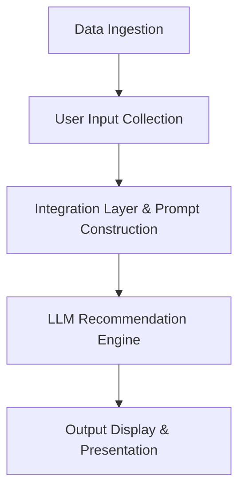

# 🍽️ AI-Powered Restaurant Recommendation System (Zomato Use Case)

## 📋 Overview
You are tasked with building a modern, AI-powered restaurant recommendation service inspired by **Zomato**. The system will intelligently suggest restaurants based on user preferences by combining structured relational data with the semantic reasoning capabilities of a Large Language Model (LLM).

> [!NOTE]
> The primary objective is to bridge the gap between hard filters (e.g., location, budget) and soft user preferences (e.g., "romantic ambiance," "quick bite") using an LLM to generate personalized, human-like recommendations.

---

## 🎯 Objectives
Design and implement an application that:
1. **Captures User Preferences** (location, budget, cuisine, ratings, and custom natural language inputs).
2. **Processes Real-World Restaurant Data** from a curated dataset.
3. **Leverages LLM Reasoners** to rank options and generate personalized, contextual recommendations.
4. **Displays clear, actionable, and visually appealing results** to the user.

---

## ⚙️ System Workflow

The application operates across five core stages:

### 1. Data Ingestion
- **Dataset**: Load and preprocess the Zomato restaurant recommendation dataset from Hugging Face:
  - 🔗 [ManikaSaini/zomato-restaurant-recommendation](https://huggingface.co/datasets/ManikaSaini/zomato-restaurant-recommendation)
- **Field Extraction**: Process and clean key attributes including:
  - Restaurant Name
  - Location / Area
  - Cuisine types
  - Cost for two (Budget)
  - Aggregate Rating
  - Highlighted features / Reviews

### 2. User Input Collection
Gather user parameters through structured controls or natural language:
- **Location**: Desired city or neighborhood (e.g., Delhi, Bangalore).
- **Budget**: Defined tiers (Low, Medium, High).
- **Cuisine**: Preferred cuisines (e.g., Italian, Chinese, North Indian).
- **Minimum Rating**: Numeric threshold (e.g., 4.0+ stars).
- **Additional Context**: Free-form text (e.g., "family-friendly", "rooftop seating", "good for study sessions").

### 3. Integration & Prompt Engineering
- **Filtering**: Pre-filter the dataset based on hard constraints (e.g., location, budget, minimum rating) to keep the search space relevant and efficient.
- **Context Injection**: Format the filtered list of candidate restaurants into structured context (e.g., JSON or Markdown lists) to inject into the LLM prompt.
- **Prompt Design**: Construct a robust system prompt instruction set that guides the LLM to act as a foodie assistant, reasoning about which choices best match the soft preferences.

### 4. Recommendation Engine (LLM)
Utilize the LLM to:
- **Rank** the pre-filtered candidate list against the user's explicit and implicit preferences.
- **Explain** *why* each recommendation fits the request, providing personalized context (e.g., *"Recommended because you wanted a quiet Italian place, and they have an outdoor garden seating"*).
- **Summarize** the overall suggestions.

### 5. Output Display
Present the recommended results in a highly readable format:
- **Restaurant Details**: Name, Cuisine, Location, Rating, and Average Cost.
- **AI Rationale**: The generated personalized explanation explaining the recommendation.
